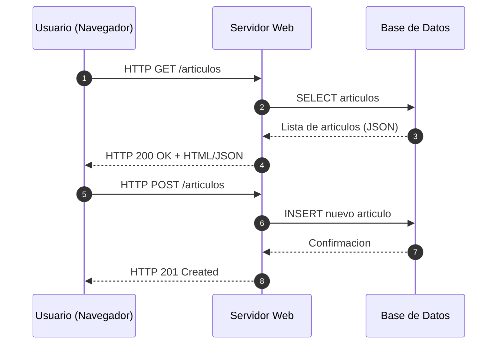

# Diagrama de secuencia HTTP

Este diagrama muestra un flujo HTTP basico entre navegador, servidor web y base de datos.

```mermaid
sequenceDiagram
  autonumber
  participant U as Usuario (Navegador)
  participant S as Servidor Web
  participant DB as Base de Datos

  U->>S: HTTP GET /articulos
  S->>DB: SELECT articulos
  DB-->>S: Lista de articulos (JSON)
  S-->>U: HTTP 200 OK + HTML/JSON

  U->>S: HTTP POST /articulos
  S->>DB: INSERT nuevo articulo
  DB-->>S: Confirmacion
  S-->>U: HTTP 201 Created
```
